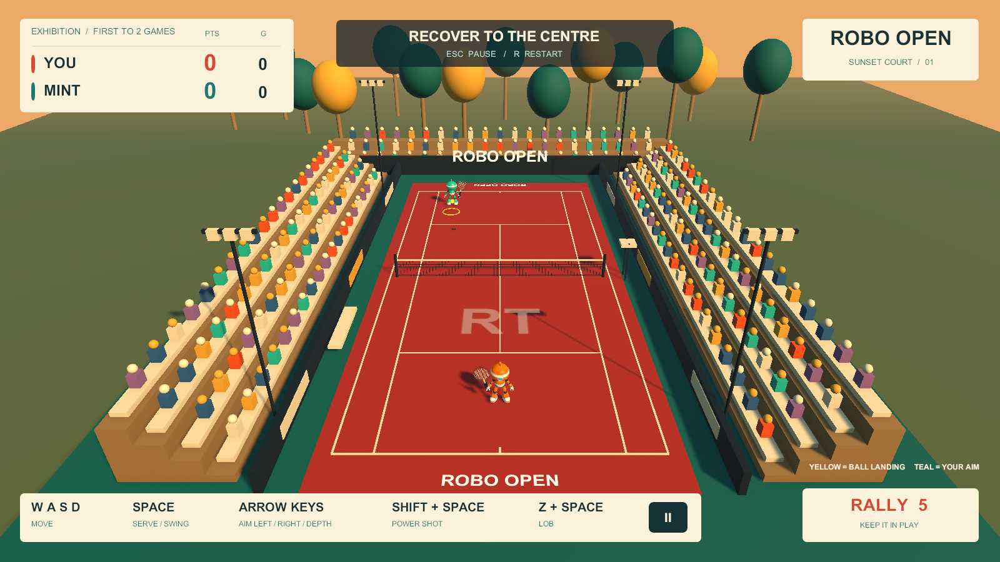
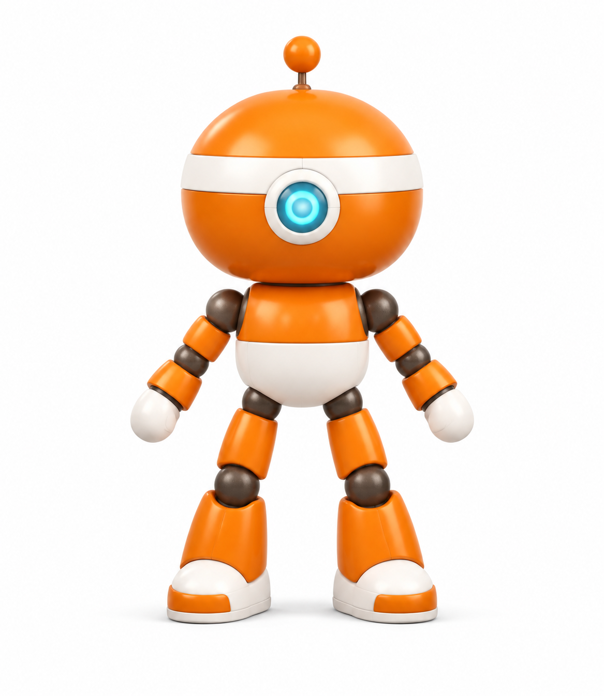
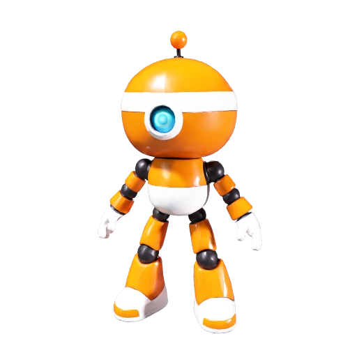

# Development Journey — Robo Open

**From a YouTube reference to a playable Windows tennis prototype.**

**Build date:** September 5, 2026. **Implementation:** a single Codex / GPT-6 Astra session. **Documentation method:** the Claude `/dev-journey` skill, applied afterward by Codex. **Inspiration:** [Chong-U’s “FABLE 5.1 Is Here And It's PERFECT For Vibe Coding Games (FULL Unity + Blender Workflow)”](https://www.youtube.com/watch?v=DQfL_l5lRpk).

The finished prototype has two animated toy robots, a coral court, a CPU opponent, serving, returns, power shots, lobs, tennis scoring, menus and a Windows executable. Its most instructive parts are the failures between those nouns: a missing executable behind an apparently installed application, a hundredfold scale error, animation that stopped in the background, a misleading screenshot, an engine linker failure and an animation-name bug that prevented the interface from appearing.

This account was reconstructed from the original session’s chronological messages and tool records, then checked against the retained scripts, scenes, asset files and machine-readable receipts. It is not a recollection based only on the final chat summary. Repeated compiler-wait messages are grouped into their actual build stages. Private paths, account identifiers, credentials, raw conversations and signed download URLs are excluded from the public evidence.



*A capture from the shipped renderer, not an image-generation mockup. [Watch the supplied match recording](docs/media/match.mp4).*

## 1. The brief — reproduce a game whose project files were unavailable

### The first prompt

The original request was:

> Watch [https://www.youtube.com/watch?v=DQfL\_l5lRpk&t=1071s](https://www.youtube.com/watch?v=DQfL_l5lRpk&t=1071s)
> end-to-end.
>
> I want you to recreate the tennis game using the same assets and in the same style as in the video.
> i should have blender and unity cli installed.
> i have 1267 meshy credits left.  MESHY\_API\_KEY in ./.env
>
> Please let me know if you have enough information to replicate the same game.

The timestamp in that link is 17:51, but “end-to-end” made the entire 20:20 video the reference boundary. The agent distinguished two requests embedded in one sentence: matching the visual direction, which the video could support, and obtaining identical assets, which a video could not supply.

The transcript was already present locally. The agent read it through the creator’s closing remarks, excluding unrelated material appended afterward. A direct web fetch was throttled. `yt-dlp` retrieved metadata and a local reference copy; FFmpeg extracted frames every five seconds. The agent inspected 244 images spanning 00:00–20:15 in 13 contact sheets, then revisited individual character and stadium frames.

**That was full-timeline sampled visual analysis plus a complete transcript. It was not uninterrupted viewing of every frame or an independent end-to-end listening pass.** The initial response explicitly disclosed this distinction. The remaining motion/audio coverage gap matters when judging claims about exact animation timing or game feel.

The description’s playable Wavedash link failed with `net::ERR_SSL_PROTOCOL_ERROR`. The creator mentioned a resource pack around 09:16–09:35, but the agent did not obtain or verify that project. The human’s next message—“I don’t have access to Creator’s project at all.”—settled the asset-access question. The practical target became a new reconstruction using the reference’s recognizable style.

### What the video established

Around 06:25, it provided a useful character reference: an orange spherical head, white band, cyan central eye, antenna, dark mechanical joints, rounded body and large shoes. Around 18:15, the stadium view established the coral/red surface, turquoise surroundings, white tennis lines, stepped colorful spectators, court branding and warm low-angle light. Other portions showed an elevated camera, cream/coral/teal interface, shot feedback and both sunset and night presentations.

These observations became a specification, not a claim that hidden geometry, shader settings, controller code or original animations had been recovered. The [replication assessment](REPLICATION_ASSESSMENT.md) records that boundary and the source timeline.

### Every recorded human decision before the prototype

| Human message, in order | What it changed | What the agent chose afterward |
|---|---|---|
| The initial prompt above | Supplied the reference, desired style and existing Meshy credential/balance context; asked for feasibility first. | Inspect the source and tools before generating assets. |
| “I don’t have access to Creator’s project at all.” | Ruled out importing the original project. | Build new assets that approximate the reference. |
| “Can you install Blender?” | Explicitly authorized installation. | Use official downloads; fall back to a user-level portable installation when the MSI lacked permission. |
| “what are other gaps in the pre-flight check” | Asked for the unresolved integration risks. | Separate installed tools from proven project, automation, import and runtime behavior. |
| “complete the first four checks” | Authorized the four concrete preflight checks, including Windows and browser builds. | Use a cheap diagnostic fixture before spending Meshy credits. |
| “Are you waiting for my approval for the demo” | Exposed ambiguity at the milestone handoff. | Explain that no approval was pending; the preceding turn had ended after the four requested checks. |
| “What is next step” | Requested the next concrete milestone. | Propose a small playable rally with serving, movement, returns and scoring. |
| “Do your need anything from me for the prototype” | Asked whether more input was required. | State Windows-first, keyboard controls, one CPU and a 400-credit initial ceiling as the defaults. |
| “Go ahead for the prototype” | Authorized execution of that proposed milestone. | Generate one robot, implement the game, repair failures, test and deliver without further design approvals. |

The **400-credit ceiling was proposed by the agent**, repeated before implementation and followed by the human’s go-ahead. It was not a separately typed human numerical instruction. The existing Meshy key and authenticated Unity installation were prerequisites supplied by the environment; the agent did not create those accounts or purchase credits.

There is no recorded human modeling, rigging, coding, shader editing or selection among generated character candidates during the prototype build. The human specified intent and scope and authorized work. The agent made the detailed production choices. After delivery, the human supplied `match.mp4` for this publication; the session does not establish its recording procedure or a formal human playtest score.

**Autonomy here meant executing many bounded decisions inside an authorized task. It did not mean the human was absent, or that the agent continued working after every final response.** The three questions around the preflight handoff are evidence of that distinction: a completed conversational turn can look like a permission gate even when none exists.

## 2. Cold start — prove the tools can work together

### 2.1 An installation folder was not an installation

Unity CLI reported version **1.0.0-beta.3**. Unity Editor **6000.5.7f1** and Windows/WebGL support folders existed. A Blender 4.4 folder also existed, but it contained support remnants rather than the expected runnable `blender.exe`. Configuration files left by an old application were nearly mistaken for a working tool.

The agent checked executable paths, command versions and help output rather than treating directory names as proof. Unity CLI initially reported `ALLUSERSPROFILE is not set`; setting that variable to the standard `C:\ProgramData` for the command process let diagnostics proceed. A fresh license check showed an active, signed-in Unity license. That prevented an older login warning from being misclassified as a current account blocker.

The machine had roughly 32 GB RAM and an RTX 3050 Laptop GPU. Those specifications established a plausible development environment, not a rendering-performance guarantee. The early free-disk check was a capacity snapshot, not an optimization benchmark.

### 2.2 Installing Blender without administrator access

The package-manager download failed with HTTP 403. An official Blender mirror worked. The agent verified the installer checksum and Blender Foundation signature, but the MSI returned error 1603; its detailed log contained error 1303, identifying insufficient privileges to write under Program Files.

Instead of repeatedly rerunning an installer that needed elevated permission, the agent used Blender’s official portable ZIP in the user’s applications directory. It checked the published SHA256, preserved existing preferences, added a user PATH entry and created a Start menu shortcut. No administrator intervention was needed.

The installed version was **Blender 5.2.1 LTS**, build `9e2066aef7ef`. A background script created a scene, saved a `.blend` and exported FBX. Its receipt said `VERIFIED: Blender 5.2.1 LTS; scene saved; FBX export successful`. This established Blender-side operation only. Unity import still needed its own test. The reproducible check remains in [setup/verify_blender.py](setup/verify_blender.py); the historical installation receipt is [here](setup/BLENDER_INSTALLATION.md).

### 2.3 The four checks and why a throwaway robot came first

The agent recommended proving four interfaces before paid character generation: project creation/compilation; live Editor automation; animated Blender import; and actual Windows plus browser execution. The human explicitly requested those checks.

Project creation first used the template name suggested by its archive filename, `com.unity.template.3d-cross-platform`. Inspecting the package’s own manifest revealed the identifier needed by the CLI: `com.unity.template.urp-blank`. The project resolved **URP 17.5.0** and **Unity Pipeline 0.6.0-exp.1**. The package manifest and lockfile were retained, making the selected dependency versions inspectable.

Initial Editor startup also encountered a licensing-client handshake/protocol mismatch. Direct Editor startup progressed to package resolution; `-automated` launches avoided modal dialogs that stalled normal interactive automation. The evidence supports those operational fixes. It does not prove a clean-room root-cause diagnosis of every earlier background licensing process.

The fixture was intentionally crude: a block-shaped robot with two bones, 168 vertices, three material slots and a two-second motion clip. [setup/create_animated_fixture.py](setup/create_animated_fixture.py) built it in Blender. It was cheap to discard and precise enough to answer whether units, axes, skin weights, normals, materials and animation survived export/import.

The first import was **200 metres tall instead of two**. Changing the FBX export’s unit handling to `FBX_SCALE_UNITS` fixed the hundredfold discrepancy. Unity then measured approximately 1.9999998 units of height and 0.3346755 units of maximum sampled skin displacement. Counting animation clips alone would not have caught a mesh that did not actually deform.

### 2.4 Giving the agent hands inside Unity

Unity Pipeline exposed an authenticated local Editor service. The CLI could discover it, enumerate supported commands, open a scene, create an `AutomationCheck` object, save and execute project helpers. The session used local port **7800**. That number was an observed session endpoint, not a port every clone must hard-code.

The important control path was:

`Codex → PowerShell / Unity CLI → local Pipeline service → Editor main thread → project C# helper → saved scene or build receipt`

The local service descriptor also contained an authentication token. It stayed in the ignored `Library` directory. Discoverability and authentication are separate concerns: a reachable editor endpoint should not be published as a credential-bearing configuration file.

The standard automation screenshot produced incorrect URP lighting. Inspection of the capture implementation revealed a `Camera.Render()` path that was unsuitable here. A project-local helper using `RenderPipeline.SubmitRenderRequest` produced the correct lit render. A bad screenshot had been evidence about the capture path, not necessarily evidence that the scene itself was wrong.

### 2.5 Executables, culling and the unexpectedly expensive browser check

The first Windows runtime launched but failed its animation-motion check. Hidden/background testing allowed the engine to cull animation. Configuring `AnimationCullingType.AlwaysAnimate` and `SkinnedMeshRenderer.updateWhenOffscreen`, then capturing through an offscreen render target, made the test meaningful. The player subsequently measured about 0.302 units of skin motion and exited 0.

Long-running builds exposed a second boundary: the Editor’s main thread could be occupied while a CLI request waited for a reply. A command timeout was not proof that the build had failed. The build helpers were changed to queue work through `EditorApplication.delayCall`, return promptly and write final build receipts. Guards reject queueing during compilation/import. While a build runs, inspect files and process progress instead of repeatedly submitting main-thread commands.

WebGL was the most expensive detour. The development build retained a large amount of otherwise unused code. The session observed a 51 MB generated generic-method table and 932 planned native object outputs. Compilation continued for a long time, then the linker failed on `unitytls_ssl_set_client_transport_id` in Unity’s TLS module.

Inspection connected broad code retention to Pipeline’s development-only hot-reload preservation. The agent switched the browser player to **`BuildOptions.None`**. This removed that preservation; the observed generated C++ file count fell from 688 to 321 and the large table roughly halved. The release TLS library also referenced the missing symbol, so merely switching modes was not enough to declare success: unused TLS code had to be stripped and linking had to finish.

The replacement build passed linking and WebAssembly optimization. Its build receipt recorded **3,201 seconds, about 53 minutes**. Browser testing then verified rendering, animation, pause, resume and rotation through actual UI clicks. One upscaling-shader warning remained. It affected the scope of the browser visual claim, not the visibly working geometry and controls.

All four preflight checks passed before Meshy generation. The browser build was a **diagnostic fixture**, not the tennis game. The much faster Windows route became the prototype’s iteration target. No missing-symbol check was suppressed and no engine library was patched to manufacture a passing build.

## 3. Design decisions — what was generated, scripted and deliberately simplified

### 3.1 One good reference image, not a scene full of guesses

The built-in image-generation tool received a character screenshot from approximately 06:25 and a tightly constrained prompt. It asked for a full-body, front-facing, orthographic robot on white, in a symmetric relaxed A-pose: arms about 35 degrees from vertical, separated legs and visible joints. It specified an oversized orange spherical head, continuous white band, cyan central eye, antenna, white belly, graphite ball joints, mitten-like hands and large shoes. It excluded rackets, scenery, text, extra characters and multiple views.

Those exclusions served production purposes. A racket fused into the hand would complicate rigging. A stadium background would introduce irrelevant geometry cues. Multiple views could be mistaken for multiple characters. Symmetry and separated limbs gave the next model clearer evidence about where one part ended and another began. A neutral reference also avoided baking sunset illumination into every surface.

The exact prompt is retained in [SourceAssets/Robot/IMAGE_PROMPT.md](SourceAssets/Robot/IMAGE_PROMPT.md). The image-generation model’s exact backend identifier and its billing were not recorded in the artifact receipt; this document does not invent them.



### 3.2 Meshy made geometry and texture, not the whole character system

[setup/meshy_robot.py](setup/meshy_robot.py) read the key locally and submitted the reference as a base64 image to Meshy’s `v1/image-to-3d` endpoint. The request selected `meshy-6`, texturing and PBR, remeshing, a requested target of 12,000 polygons, A-pose, 2k textures, lighting removal and GLB/FBX outputs. The requested polygon target is not the same thing as the measured imported vertex count.

The API was asynchronous: submit once, save the task identity, poll status, then download output files. The helper wrote a spending reservation **before** submission. It refused a second generation of the same kind when an entry already existed. That protects against blindly issuing another paid request after an uncertain response. It is a local safety mechanism, not proof of universal API-level idempotency.

The generation reserved 40 credits conservatively and actually consumed **30**. A subsequent automatic-rigging request reserved five and returned HTTP 422 before a usable rig-task identity was recorded. The agent did not repeatedly resubmit. A fresh balance check still showed **1,237**, consistent with 30 total credits spent and no additional rigging charge.

An earlier progress message attributed the rejection to toy-like proportions. **The retained HTTP error does not establish that cause.** A schema or task-compatibility issue could also produce a 422. The reliable conclusion is that this rig request failed; the custom Blender fallback succeeded. Preserving that distinction prevents a convenient story from becoming a false technical diagnosis.



### 3.3 Blender supplied the missing skeleton and motion

The GLB contained a surface, not a finished tennis controller. The Blender script imported it, applied rotation/scale, transformed vertices into a common coordinate frame, centered the body, placed the feet at ground level and normalized total height to **1.8 metres**. It extracted the image connected to the material’s base-color input into a stable PNG.

It then constructed **16 bones**: Root, Hips, Spine, Head, plus upper arm, forearm, hand, thigh, shin and foot on each side. Bone positions were authored for the toy’s proportions. This was not a human-shaped stock rig blindly stretched over a large-headed character.

Skinning used a spatial heuristic. Height and horizontal position first separated head, torso, arms and legs. The script measured distance to candidate bone segments, assigned the nearest bone and blended with a second bone near a boundary. Weights summed to one. This made a plausible usable skin quickly, but it was not artist-painted anatomy or a guarantee against every elbow or hip deformation artifact.

At 30 frames per second, the script keyed quaternion rotations and small root offsets for five nominal clips:

| Clip | Nominal duration | How its motion was authored |
|---|---:|---|
| Idle | 2.0 s | Small head rotation and body bob; relaxed arms. |
| Run | 0.66 s | Alternating thigh/arm swings, knee bend and a small vertical bounce. |
| Serve | 0.75 s | Raised racket arm, opposite-arm lift and torso bend. |
| Forehand | 0.55 s | Shoulder/forearm swing plus torso/head rotation. |
| Backhand | 0.55 s | Opposite swing direction and corresponding torso rotation. |

Frame counts are rounded by the script, so these are design durations rather than claims about infinitely precise timing. Actions were retained, exported with animation baking, no extra leaf bones, Blender-to-Unity axis conversion and `FBX_SCALE_UNITS`. The source `.blend`, exported FBX and [rigging script](setup/rig_robot_blender.py) preserve the work.

Unity later measured 11,813 imported vertices, all five clips and approximately **0.394** units of maximum forehand skin displacement. The quantitative check proved that the skin moved. It did not certify artist-quality deformation across every frame.

### 3.4 The stadium was procedural Unity geometry

An early plan proposed Blender for the stadium and rackets. **The delivered version built those parts directly in Unity C#**, using [PrototypeSetup.cs](TennisGame/Assets/Prototype/Editor/PrototypeSetup.cs). The implementation is the source of truth when a plan and a finished artifact differ.

The court uses cuboids for the surface and narrow raised strips for lines; the net combines posts, tape and a simple grid. Stepped bleachers hold repeated block-and-sphere spectators in a small color palette. Cylinders and spheres make trees; additional primitives make floodlights, benches, an umpire platform and plaza boundaries. Deterministic placement made the scene regenerable instead of requiring hundreds of manual object edits.

Rackets are separate objects made from a grip, neck, line-renderer frame and crossed strings. Each racket is parented to the imported `Hand.R` bone. This matters: the animation moves the hand, and the attached racket follows. A later runtime transform override was removed so it would not fight the animated skeleton.

Generating a second independent robot could have produced different proportions and doubled rigging work. Instead, the CPU reuses the same mesh and animation system. [RobotTint.shader](TennisGame/Assets/Prototype/RobotTint.shader) selectively shifts orange surfaces toward mint while preserving white parts and the cyan eye. That gave two identifiable sides with one paid model and one rig.

### 3.5 The visual system is functional as well as decorative

The palette follows the reference: coral clay, teal surrounds, cream panels, dark ink text and warm directional light. The camera is elevated behind the player. Iteration moved it to `(0, 14.4, -25.8)`, looking toward `(0, 0.35, -1.0)`, with a 51-degree field of view. Those are final implementation values, not parameters recovered from the creator.

The HUD has a scoreboard, shot callouts, aim/landing legend, controls, main menu, pause overlay and result screen. It uses Unity UI and a built-in font; rounded panels are generated procedurally. There was no Figma-to-Unity import and no external UI-art pack. To support different window shapes, a centered 1600×900 layout scales by the smaller width/height ratio instead of assuming the whole screen has that aspect ratio.

Sunset light made the original lit markers look too similar to the court. The final ball and yellow/teal marker materials use an unlit path so their identification colors remain stable. The ball is intentionally bright and oversized for readability. This is an arcade-interface choice, not a regulation-ball rendering experiment.

### 3.6 Scope cuts that kept the prototype finishable

The milestone used one court, one CPU opponent and a short exhibition: first to two games. It omitted sets, tiebreaks, progression, multiplayer, day/night switching, detailed crowd animation, a distinct overhead-smash mechanic and exact replication of the original UI. The final deliverable nevertheless added menus, simple crowds and short synthesized sound effects because they made the local prototype coherent and usable.

No ElevenLabs account, licensed soundtrack purchase, mocap session or further Meshy model was needed. Hit, bounce and point sounds were generated locally as short decaying tones. Windows was selected over a new WebGL tennis build because the preflight had demonstrated the browser toolchain’s cost and fragility.

## 4. The core problem — make a generated surface participate in a reliable game loop

### 4.1 The production chain

The asset chain was:

`Video reference → new reference image → Meshy GLB + textures → Blender normalization / skeleton / weights / clips → Unity FBX import → RobotActor → game scene`

The runtime chain was:

`Input or CPU decision → match state → target selection → launch velocity → ball trajectory → net / landing / bounce rule → point / game / match → HUD and sound`

These are different systems. An image model does not know when a tennis point ends. Meshy does not choose a scoring rule. Blender does not decide whether a click should pause the game. The agent’s contribution was writing the glue, choosing interfaces and checking observable behavior at each boundary.

### 4.2 Ball physics was designed backward from a target

The game does not ask a Rigidbody to discover an arbitrary shot from racket-mesh collision. It chooses a target and a flight time, then solves for the initial velocity. For gravity magnitude `g`, start `p₀`, target `p₁` and duration `T`:

```text
vx = (target.x - start.x) / T
vz = (target.z - start.z) / T
vy = (target.y - start.y) / T + 0.5 × g × T
p(t) = p₀ + v₀ × t - 0.5 × g × t² × up
```

This turns “aim over there” into a repeatable arc. Normal returns use a nominal 1.55-second flight; power returns start at 1.18 seconds; lobs use 2.0 seconds. Ordinary returns lengthen their flight when needed to clear the net. Longer flight means a higher initial vertical velocity and more hang time. The HTML version includes an interactive illustration of this tradeoff.

The match code advances the ball in substeps no larger than 1/120 second, interpolates height when crossing the net plane and checks the first ground contact. It tracks the last hitter, receiver, bounce count and whether the current flight is a serve. A second bounce awards the point; a first bounce outside the appropriate court or service box awards the opponent or triggers a service fault.

Gravity is 9.81, singles half-width is 4.115 and half-length is 11.885 Unity units. The ball radius is 0.12, and the net uses a simplified uniform 0.96-unit height. Court-line tests include a radius allowance. These are prototype rules with deliberate tolerance, not a complete implementation of officiating geometry, spin, drag, let serves or foot-fault detection.

### 4.3 The “racket hit” is a forgiving gameplay window

The player presses Space, Enter or the left mouse button. A 0.27-second input buffer allows a slightly early swing. A hit is accepted when the ball is on the correct side, at a reachable height and within a horizontal reach zone around the robot: 1.85 units for the player, 1.58 for the CPU. A cooldown prevents immediate repeated contact.

The animation and sound communicate the hit, but the rule is not precise racket-triangle contact. Parenting the racket to the hand improves visual coherence; it does not make collision physically exact. **A plausible swing and a physically simulated impact are different milestones.** Tightening their synchronization remains a sensible next pass.

The implementation explicitly prevents a serve receiver from volleying before the first bounce. The server is placed behind its baseline, and the automated player no longer walks inward before serving. These corrections illustrate why familiar sport rules still need explicit state in code.

### 4.4 The CPU predicts; it does not learn

Mint moves toward the predicted landing location, generally standing behind the first bounce and following the ball afterward. Its movement speed is limited. It targets different return locations with a seeded pseudo-random sequence, and after sufficiently long rallies it sometimes overhits. Boundary rules, rather than a special “give the human a point” shortcut, decide the resulting outcome.

During testing, the automated player initially chased and returned shots that were heading out. That could rescue the CPU’s mistakes and keep rallies going without points. The final automation avoids returning those predicted-out shots before their first bounce; the CPU applies a corresponding check. The test then produced sustained rallies **and** real scoring transitions.

The seed improves repeatability of target choices, but frame timing and movement still affect the simulation. This is not a lockstep deterministic networking system, a trained reinforcement-learning agent or an adaptive difficulty model.

### 4.5 Scoring and presentation are separate from flight

[TennisRules.cs](TennisGame/Assets/Prototype/Scripts/TennisRules.cs) contains scoring and trajectory helpers. Points display as 0, 15, 30 and 40; equal scores after three points produce deuce; a one-point lead produces advantage. A game needs at least four points and a two-point margin. The first player to two games wins the exhibition. Serving changes by game.

[TennisGame.cs](TennisGame/Assets/Prototype/Scripts/TennisGame.cs) controls `Menu`, `Ready`, `Rally`, `Point` and `Finished` phases. Pausing freezes game time; restart clears match state; result/replay follows the same match logic. [TennisHud.cs](TennisGame/Assets/Prototype/Scripts/TennisHud.cs) displays those states and binds buttons. [RobotActor.cs](TennisGame/Assets/Prototype/Scripts/RobotActor.cs) chooses idle/run/strike clips.

Separating scoring from the visual scene enabled cheap rule tests. Keeping the actual phase transitions in the runtime let standalone input tests catch mistakes that pure arithmetic checks could not.

### 4.6 The actual sequence after “Go ahead”

The prototype took about **52 minutes** from the go-ahead to final delivery. The entire conversation, starting with feasibility and including human gaps and long preflight builds, spanned about **4 hours 23 minutes**. These are elapsed session intervals, not measured active coding time or a forecast for another machine.

| Order | Action | Concrete result or correction |
|---:|---|---|
| 1 | Reuse the verified Unity project and visual assessment. | Avoid repeating package, license and import discovery. |
| 2 | Inspect the robot reference and generate one clean image. | White-background A-pose input for Meshy. |
| 3 | Submit one budgeted Meshy job. | Continue C# work while the service runs. |
| 4 | Write scoring, court bounds and ballistic helpers. | Rules become independently testable. |
| 5 | Implement phases, player controls, CPU movement and shot types. | A complete logical rally path exists. |
| 6 | Add procedural court, stadium, camera, materials and HUD. | A reconstructible scene rather than a hand-placed one-off. |
| 7 | Download the completed robot and attempt auto-rigging once. | Model succeeds; rig request returns 422. |
| 8 | Build the custom Blender skeleton, weights and five clips. | Save source and export FBX. |
| 9 | Import and measure the robot; attach rackets; tint Mint. | 16 bones, five clips and real skin displacement. |
| 10 | Correct server positions and prohibit serve volleys. | Service behavior matches the intended rule. |
| 11 | Enter Play mode and inspect logs/captures. | Find clip-name case bug that aborted initialization. |
| 12 | Fix clip lookup; remove racket-transform conflict. | Animation initializes and HUD can be created. |
| 13 | Correct robot orientation, camera framing and missing park ground. | Replace floating-tree impression and awkward presentation. |
| 14 | Inspect the live wide Editor view. | Fix the centered, aspect-safe UI layout and capture sizing. |
| 15 | Exercise menu, serving, movement, aim, pause and restart. | First live input suite passes. |
| 16 | Prevent automated players from rescuing predicted-out balls. | Sustained rallies can also award points. |
| 17 | Build a normal Windows player. | First prototype build succeeds after shader compilation. |
| 18 | Launch standalone input and one-minute rally checks. | Normal, power and lob inputs pass; 18-shot best rally, two points. |
| 19 | Refine serving-player framing and clear markers on menu return. | Controls no longer crowd the server; menus reset cleanly. |
| 20 | Test a match-point fixture and the Play Again button. | Result and replay paths pass. |
| 21 | Make ball and marker colors independent of sunset lighting. | Yellow landing and teal aim are visually distinct. |
| 22 | Rebuild, rerun checks and inspect fresh screenshots. | Final passing Windows executable, launcher and documentation. |

The record contains many small operational reads and waits around these steps. They are part of autonomous work: checking whether a command finished, reading errors, choosing the next corrective action and withholding success claims until evidence arrives.

## 5. Tools and features used — their actual jobs

| Tool or component | What it did in this session | What it did not establish by itself |
|---|---|---|
| Codex / GPT-6 Astra | Planned, wrote scripts, operated tools, inspected results and iterated. | A guarantee that its first diagnosis or generated code was correct. |
| PowerShell, `rg`, local file/process inspection | Located executables, read source/logs, launched processes and checked artifacts. | That a process consuming CPU would eventually succeed. |
| Web search and official documentation | Checked source links, Blender distribution routes, Meshy parameters/pricing and Unity failure context. | Access to the creator’s hidden project. |
| `yt-dlp`, FFmpeg, contact-sheet inspection | Retrieved reference metadata/media and sampled its full timeline. | Continuous motion/audio analysis. |
| Blender Python / `bpy` | Built the diagnostic fixture and custom production rig, weights and clips; exported FBX. | Artist-approved deformation or precise sports biomechanics. |
| Built-in image generation | Created one isolated robot reference from the screenshot direction. | A mesh, skeleton or usable game controller. |
| Meshy HTTP API | Generated one textured robot and returned GLB/FBX assets; reported credit usage. | A successful automatic rig, which failed. |
| Unity CLI + Pipeline | Created the project, inspected/editor-operated the scene and ran helpers. | Completion of queued builds. |
| Unity C# + URP + shader code | Implemented gameplay, scene construction, materials, presentation and captures. | Exact identity with the source video’s implementation. |
| Unity Input System + UI EventSystem | Drove normal controls and actual pointer-click checks. | A human usability evaluation. |
| Browser automation + local HTTP server | Tested the preflight WebGL player and its controls. | A WebGL version of the finished tennis prototype. |
| JSON receipts and PNG captures | Preserved rule, import, build, runtime and visual evidence. | Proof of an untested scenario. |
| Git and `.gitignore` | Established source boundaries before publication. | That untracked files were already committed; they were not. |
| Claude `/dev-journey` skill | Structured this retrospective around evidence, failures, choices and human involvement. | A claim that Claude built the prototype. |
| FFmpeg and `gh` in the publication pass | Compressed the supplied match recording and prepared/published the documented project. | Native README playback without GitHub’s attachment/rendering path. |

The build was done inline by one coding agent. **No subagents or advisor agents were spawned.** Tool-level parallelism did occur: independent shell reads were batched, and local implementation continued while Meshy or a compiler ran. Parallel tools are not the same as multiple reasoning agents.

A source-log sweep counted 299 orchestration batches, containing 284 `exec_command`, 80 `write_stdin`, 49 `apply_patch`, 23 `view_image`, 12 web calls and one image-generation call; it also found 15 browser `js` calls, one browser reset and 86 sleep calls before final prototype delivery. These are recorded orchestration counts, not a count of every operating-system subprocess, API poll inside a script or reasoning token. Many sleep/poll calls belonged to the long WebGL preflight.

Standing instructions favored local execution, frequent progress reports, evidence-backed claims and proceeding within existing authorization. The session read a media-use skill during source inspection and the image-generation skill before making the robot reference. It did not invoke all the many installed skills. No persistent memory was updated; the project’s assessment, scripts and receipts served as the durable handoff.

## 6. What went wrong — symptoms, fixes and near-misses

Errors below preserve the diagnostic text where retained; private path portions are generalized. Where there was a visual or numeric failure instead of an exception, that is stated explicitly.

1. **Blender looked installed but was not runnable.** The attempted executable produced `is not recognized as a name of a cmdlet, function, script file, or executable program`. Inspecting files exposed the remnants. Install and execute the real binary; do not trust an old folder.

2. **Unity CLI lacked a Windows environment value.** `Error: Unable to resolve config folder: ALLUSERSPROFILE is not set.` Set the standard value in the process environment. This was a launcher/environment failure, not a broken tennis project.

3. **The video page and live reference were not reliable access paths.** The web fetch reported `Online fetch throttled`; the playable link reported `net::ERR_SSL_PROTOCOL_ERROR`. Local transcript plus sampled reference video supplied evidence, with the continuous-viewing gap explicitly retained.

4. **The main Blender download route rejected access.** `0x80190193 : Forbidden (403).` Use the official mirror and verify the downloaded artifact. A mirror without provenance checks would simply trade availability risk for integrity risk.

5. **The MSI required unavailable write permission.** Exit `1603`, with `Error 1303. The installer has insufficient privileges to access this directory`. The portable, user-level package solved the actual installation constraint; repeated privileged-path attempts would not.

6. **A template archive name suggested the wrong identifier.** The selected archive’s internal package manifest identified `com.unity.template.urp-blank`. Inspecting it resolved the project-creation mismatch. Filenames and package IDs are different namespaces.

7. **Editor startup encountered a licensing handshake mismatch and dialogs.** Logs included `[Licensing::Client] Error: HandshakeResponse reported an error:` and a failed licensing initialization. Fresh license status, direct Editor startup and automated launch mode established a working path. The record does not justify claiming that every background licensing issue was independently diagnosed.

8. **The diagnostic C# receipt used the wrong numeric type.** `error CS0266: Cannot implicitly convert type 'int' to 'uint'. An explicit conversion exists (are you missing a cast?)` Correcting the receipt/build-summary types allowed compilation. This was an agent-authored coding error.

9. **FBX units were off by 100×.** A numerical assertion found a nominal two-metre fixture at 200 metres. `FBX_SCALE_UNITS` fixed it, and the new measured height confirmed the change. An import operation returning successfully would have missed it.

10. **A screenshot falsely suggested broken lighting.** No useful shader error explained the image. The capture path used `Camera.Render()`; switching to a supported URP render request produced the expected scene. Later, an old PNG was briefly inspected before a queued capture finished. Checking completion and file modification time prevented stale evidence from becoming a new rendering diagnosis.

11. **Background testing stopped skin motion.** The standalone fixture launched but failed its deformation check. Offscreen animation/culling settings and a render-target capture restored actual motion. “The process starts” was insufficient acceptance evidence.

12. **Automation deadlines and build duration were confused.** The record includes `Pipeline command 'menu' timed out after 30000ms` and `Main thread operation timed out after 60000ms`. Queue builds, guard compilation/import, and read final receipts. An acknowledgement is a promise to try, not proof of completion.

13. **WebGL development linking failed inside the engine.** `undefined symbol: unitytls_ssl_set_client_transport_id(unitytls_tlsctx*, unsigned char const*, unsigned long)`. Removing development-only broad preservation through a normal build allowed unused code stripping; successful linking and browser execution established the fix’s operational result. A proposed additional stripping hook remained unnecessary after the build passed.

14. **Browser post-processing remained limited.** `Shader 'Hidden/Universal Render Pipeline/Edge Adaptive Spatial Upsampling' is not supported (in 'Blit FSR Upscaling'). PostProcessing render passes will not execute.` The fixture’s model, lighting, animation and buttons worked. Production browser post-processing was not certified or silently declared fixed.

15. **Meshy auto-rigging failed and left an uncertain ledger state.** `urllib.error.HTTPError: HTTP Error 422: Unprocessable Entity`, followed by `RuntimeError: No identified task; inspect submission before retrying`. The helper had recorded submission before the API returned, so it stopped another blind attempt. The agent reconciled the entry as rejected, checked the balance and authored a local rig. The exact remote rejection cause remains unknown.

16. **Blender export emitted texture/extension cleanup warnings.** The rig/export completed; the usable base-color texture was extracted and used explicitly in Unity. Missing auxiliary map copies did not become a claim of full PBR parity. Factory startup is the cleaner repeatable invocation for avoiding unrelated user extensions during background asset work.

17. **Lowercased animation names broke initialization.** `NullReferenceException: Object reference not set to an instance of an object`. `RobotActor.Play` indexed a case-sensitive animation collection with lowercased keys. The exception interrupted `Start` before the HUD existed, producing secondary HUD errors in `Update`. Preserve exact clip keys and lowercase only the search comparison. Fix the first cause, not each downstream symptom.

18. **A remembered path omitted one directory.** `File Not Found` / `Source file not found`. The helper lived at `TennisGame/Automation/PrototypeJobs.cs`, not `Automation/PrototypeJobs.cs` relative to the workspace. A targeted file inventory corrected the path. A compacted summary had not preserved the directory boundary clearly enough.

19. **World framing exposed incomplete scene assumptions.** Trees appeared to float beyond the plaza because there was no ground beneath them. The near player’s orientation and baseline framing also needed inspection. Add park ground, rotate the imported model and adjust the camera using actual captures.

20. **The Editor’s aspect ratio broke a fixed-position HUD.** The observed Editor surface was 881×377; a 1600×900 capture used a different camera aspect. Controls could fall outside the effective layout. Center a reference-sized layout, fit it to the smaller dimension and temporarily match the render target during capture. Split the oversized two-line title when its second line clipped.

21. **The test player kept saving bad shots.** It could reach an overhit before the first bounce and return it, hiding scoring opportunities. Avoid intercepting predicted-out balls in the automated policy and require at least one awarded point in the acceptance receipt. A long rally alone was too weak a success condition.

22. **Menu cleanup and small visual details still affected usability.** Returning to the menu initially left marker/shadow objects active. The serving player crowded the bottom controls, and warm lighting obscured marker identity. Clear those objects, reframe the camera and use stable unlit identification colors. Each final change was rebuilt and checked in fresh player captures.

The optional Pipeline runtime server produced a build warning because no runtime configuration was supplied. That service was unnecessary inside the exported game; Editor automation still worked. This warning is recorded rather than removed merely to obtain a zero-warning badge.

## 7. Verification — what “works” actually means here

### The evidence ladder

The session progressed through increasingly strong claims: executable exists; tool runs; project compiles; asset imports; skin deforms; scene renders correctly; player launches; input reaches gameplay; normal rallies award points; match-result and replay states work. Each claim required a different observation.

| Acceptance evidence | Observed result | Public receipt |
|---|---|---|
| Preflight Blender import | Two bones, 168 vertices, approximately two-unit height and measurable deformation. | [Import](docs/evidence/preflight-import.json) |
| Preflight Windows runtime | Actual background skin motion; passing receipt. | [Runtime](docs/evidence/preflight-windows-runtime.json) |
| Preflight WebGL | Normal build succeeded; live browser animation and three interaction updates. | [Build](docs/evidence/preflight-webgl-build.json), [browser](docs/evidence/preflight-webgl-browser.json) |
| Production rig import | 16 bones, 11,813 vertices, five clips, ~0.394-unit forehand displacement. | [Robot](docs/evidence/robot-import.json) |
| Rules | All 17 checks passed. | [Rules](docs/evidence/rules-tests.json) |
| Standalone input/UI | All 17 checks passed; process exited 0. | [Inputs](docs/evidence/prototype-input-tests.json) |
| Standalone rally | 15 player returns, 18 CPU returns, best rally 18, two points in about one minute. | [Runtime](docs/evidence/prototype-runtime.json) |
| Final Windows build | Succeeded, zero errors, one understood optional-service warning. | [Build](docs/evidence/windows-build.json) |

The 17 input checks use queued Unity Input System events and actual UI pointer clicks. They cover starting a match, serving, W/D movement, right-arrow aiming, pause, frozen physics, resume, restart, return to menu, starting again, normal return, power return, lob, a result screen and replay.

There are two distinct kinds of automated scenario. Shot-type comparisons place a controlled incoming ball near the player so the test can compare normal, power and lob responses. The result check starts from a match-point fixture and lets the **normal double-bounce rule** finish the match, then clicks Play Again. Separately, the one-minute run uses normal serving, CPU movement, targeting, trajectories and scoring, with an automated policy operating the human side.

**The 2–0 result screenshot is a match-point fixture, not proof that the agent naturally played an entire two-game match.** The rally receipt is stronger evidence for sustained play but only contains two awarded points. Neither replaces human assessment of timing, difficulty, comfort or whether the game is enjoyable.


The standalone runner [setup/verify_prototype.ps1](setup/verify_prototype.ps1) launches fresh player processes, requires recently written passing receipts and zero exit codes, and checks their logs for common exceptions and shader errors. A stale successful JSON file cannot satisfy its freshness check. It imposes a bounded timeout on its own test processes.

The final artifact targets 60 fps, but no sustained frame-time benchmark, thermal test, wide hardware survey or Windows distribution/signing test was performed. Animation quality was sampled numerically and visually, not exhaustively certified. Full reference-video audio/motion coverage and the source game’s exact feel remain unresolved.

### Cost and time without invented precision

Meshy started at 1,267 credits. One model consumed 30; the failed rig request added no observed charge; the checked balance was 1,237. The 400-credit initial ceiling was never approached. The public [spending receipt](docs/evidence/spending.json) omits service task identifiers.

The session did not measure Codex token billing, image-generation billing, electricity or a combined dollar cost. It would be misleading to describe the whole project as “costing 30 credits”; that is the measured **Meshy** consumption only.

The first successful diagnostic Windows build took about 31.7 seconds. The successful WebGL preflight took about 53 minutes. The prototype’s first normal Windows build took about 308 seconds, followed by cached builds around 99 seconds and 6.7 seconds as changes narrowed. These differences explain why the initial integration check was more expensive than many later edits.

## 8. Where things stand — and the unknown unknowns made visible

### The deliverable and its limits

The repository contains the Unity project, authored scripts, generated/imported assets, reference prompt, readable journey, sanitized receipts and compressed match recording. The local Windows deliverable is `Builds/RoboOpen-Windows/RoboOpen.exe`; [README.md](README.md) is the current entry point for obtaining or building it. The source scene is `TennisGame/Assets/Prototype/RoboOpen.unity`.

This is a recognizable, playable reconstruction with prototype-quality animation/contact and a simple CPU. The creator’s exact assets, full tournament structure, multiplayer, progression, night mode, precise contact synchronization and production browser version remain outside the delivered milestone. It stands as a Windows prototype without them. Source assets or more reference coverage would improve fidelity; targeted human playtesting would guide contact/difficulty changes; a separate browser/performance milestone would address portability.

### Questions a first-time autonomous-game builder might not know to ask

**“If the AI can see the character, why can’t it recover the exact asset?”** An image contains projected appearance, not hidden topology, UV layouts, textures, rig constraints or source code. Many different 3D objects can produce similar pixels. Reference reconstruction is an inverse problem with missing information. The solution here was a new asset pipeline, with identity claims limited accordingly.

**“Does a generated model arrive ready to animate?”** Usually the mesh, texture, skeleton, skin weights, clips and controller are separate deliverables. This project had to supply the missing rig and motion itself. Check each layer independently; do not let an attractive preview stand in for a deformation test.

**“Why use one view when multiple views contain more information?”** More views can help a suitable multi-view pipeline, but can confuse a single-image endpoint into creating several objects. The chosen endpoint and brief favored one isolated A-pose. That is a pipeline-specific decision, not a universal rule against turnarounds.

**“Why did the robot become 100 times too large?”** Different applications and formats encode units differently. A successful file exchange can preserve a shape while changing its scale. A known-size fixture makes this visible before movement speed, camera distances and collision ranges are tuned around the wrong world.

**“Why can the Editor look right while the build fails?”** Editor, exported player and browser use different compilation, stripping, rendering and background-execution paths. The TLS failure and offscreen-animation failure lived in those boundaries. Test the thing users will run, not only the environment used to author it.

**“Why can a screenshot be wrong when the scene is right?”** Rendering pipelines have specific capture entry points; aspect ratio, camera target and UI scaling can differ between a Game view and an offscreen image. File freshness adds another layer. Treat the capture apparatus as part of the experiment.

**“How does the agent know it has finished?”** It needs explicit acceptance evidence. A paid task ID, a queued build, an existing executable and a passing rule test each prove different things. Here the final contract included skin movement, normal returns by both sides, awarded points, UI input, process exit and fresh visual inspection.

**“Why didn’t every successful rally end in a useful test?”** A test policy can unintentionally compensate for an opponent’s errors. The automated receiver was rescuing overhits. Requiring scoring as well as rally length revealed that weakness. Good tests constrain observable outcomes without teaching the system merely to report success.

**“Is realistic physics always better?”** Not for every arcade prototype. Backward-solving trajectories gives predictable aiming, readable lobs and consistent net clearance. The tradeoff is simplified impact, spin and ball behavior. Decide what the player should control before choosing a physics abstraction.

**“Does the CPU use AI?”** In the ordinary game-development sense it has scripted opponent behavior. It does not call a language model during play and does not train itself. Generation-time AI and runtime game AI are different systems with different latency, cost and reliability properties.

**“Does autonomy remove approvals and human judgment?”** It removes many routine micro-decisions after authorization. It does not choose the human’s objective, supply credentials, decide publication privacy or certify fun. The original scope-setting messages and the later public-repository choice are part of the work, not administrative noise.

**“Does one credit ledger prevent every duplicate charge?”** No. It prevents this helper from casually resubmitting a known task kind. A crash between a remote acceptance and local ID persistence can still leave an uncertain state. Reconcile that state before paying for another attempt. This session’s conservative stop after the failed rig request illustrates the principle.

**“Can I reproduce the same generation from the same prompt?”** The saved GLB/FBX, textures and scripts are more reliable reproduction inputs than a fresh remote generation. Model versions and service behavior can change. Preserve outputs and software versions; do not call a prompt alone a deterministic build recipe.

**“Can I upload the working folder as-is?”** Working directories accumulate keys, signed URLs, local paths, logs, source-video copies, caches and binary metadata. Documentation scrubbing alone is not enough if a model file still embeds an exporter’s absolute path. Publication requires a deliberate file boundary and a fresh scan of what Git will actually send.

**“Why doesn’t an MP4 link automatically play inside a GitHub README?”** Git storage and GitHub’s native attachment renderer are different systems. The compressed file remains in the repository for durability and in the HTML player for direct playback. Native README playback uses an uploaded GitHub video attachment, whose rendering must be checked after publication.

**“What would I improve next?”** Start with one human-observed problem: missed returns despite apparently good timing, awkward racket alignment or an unfair CPU shot. Record the triggering situation, then adjust hit timing, animation/contact synchronization or targeting and rerun the relevant checks. Multiplayer and prettier crowds are separate investments; they will not repair basic contact feel.

### Publication is another engineering stage

The human requested this retrospective, a README, compression of `match.mp4`, inline README playback, personal-information removal and a push to the named GitHub repository using `gh`. When the repository did not resolve, the agent asked one preference question; the human explicitly chose **Public**.

The original recording was about 45.2 MB and 56.55 seconds. FFmpeg cropped window chrome, resized to 1280×722, encoded H.264/yuv420p at CRF 24, removed audio and personal metadata, and moved the MP4 index to the front for progressive playback. The public silent copy is about **2.81 MB**, roughly **94% smaller**, at 30 fps and about 56.5 seconds. The small duration difference comes from retaining the video timeline while omitting the slightly longer audio tail.

The first documentation browser connection failed with `privileged native pipe bridge is not available; browser-client is not trusted`. The available Chrome control path worked. Its first file-chooser upload then returned `Not allowed`; the browser’s documented remedy was enabling the ChatGPT extension’s “Allow access to file URLs” setting. This was a concrete human/environment dependency, not a reason to stop writing the document or scrubbing the repository.

The human subsequently enabled the extension setting and supplied a screenshot confirming it. Retrying the same compressed file succeeded, producing the GitHub attachment used in the README. No issue or comment needed to be posted. This additional human action was required by browser permissions, not by game implementation.

The publication scan also found exporter home paths in two FBX files and two Blender sources. A dedicated sanitizer rewrote the FBX string properties and checked that every other parsed property remained identical. It made Blender paths relative, removed remaining fixed-width saved-file path fields and reopened both files, confirming unchanged vertex/bone/action counts. Original files stayed in ignored local backups. The [asset privacy receipt](docs/evidence/asset-privacy.json) records those checks.

The release scan additionally found an absolute PDB debug-file path inside Assembly-CSharp.dll. Only that CodeView filename was replaced, with fixed-length padding; gameplay code and file offsets were preserved. The distributed archive was extracted and subjected to the standalone checks again. A source-only build-helper fix also creates the ignored evidence directory before writing a build receipt, so fresh clones do not depend on a folder left behind by development.

The [publication receipt](docs/evidence/publication.json) records the final upload, rendering and repository checks. This page deliberately keeps the initial failure in the story even when the later upload succeeds.

### Knowledge retained

The assessment preserves source observations and the fidelity boundary. Preflight documents preserve integration failures and fixes. The design and results documents preserve the prototype contract and actual evidence. The source scripts preserve how assets and scenes were made. This journey connects those artifacts to the human decisions and the failed assumptions between them. The README supplies the short route back into the project.

Persistent personal memory was not updated. Raw session history and private service responses remain outside the public repository. The public evidence is intentionally small, relative-path-based and sufficient to inspect the claims without exposing the original working environment.

### References and reproduction pointers

- [Original YouTube inspiration](https://www.youtube.com/watch?v=DQfL_l5lRpk), including [the character vicinity](https://www.youtube.com/watch?v=DQfL_l5lRpk&t=385s) and [stadium vicinity](https://www.youtube.com/watch?v=DQfL_l5lRpk&t=1095s).
- [Meshy image-to-3D documentation](https://docs.meshy.ai/en/api/image-to-3d), [rigging documentation](https://docs.meshy.ai/en/api/rigging), and [pricing](https://docs.meshy.ai/en/api/pricing). The recorded request and measured spending, rather than a promise about future pricing, support this account.
- [GitHub’s attachment documentation](https://docs.github.com/en/get-started/writing-on-github/working-with-advanced-formatting/attaching-files), including supported video formats and its H.264 compatibility recommendation.
- [Prototype design](PROTOTYPE_DESIGN.md), [prototype results](PROTOTYPE_RESULTS.md), [preflight results](PREFLIGHT_RESULTS.md), and [Unity project guide](TennisGame/README.md).
- [Scene generator](TennisGame/Assets/Prototype/Editor/PrototypeSetup.cs), [rig generator](setup/rig_robot_blender.py), [game controller](TennisGame/Assets/Prototype/Scripts/TennisGame.cs), [input checks](TennisGame/Assets/Prototype/Scripts/PrototypeInputChecks.cs), and [standalone verification runner](setup/verify_prototype.ps1).
