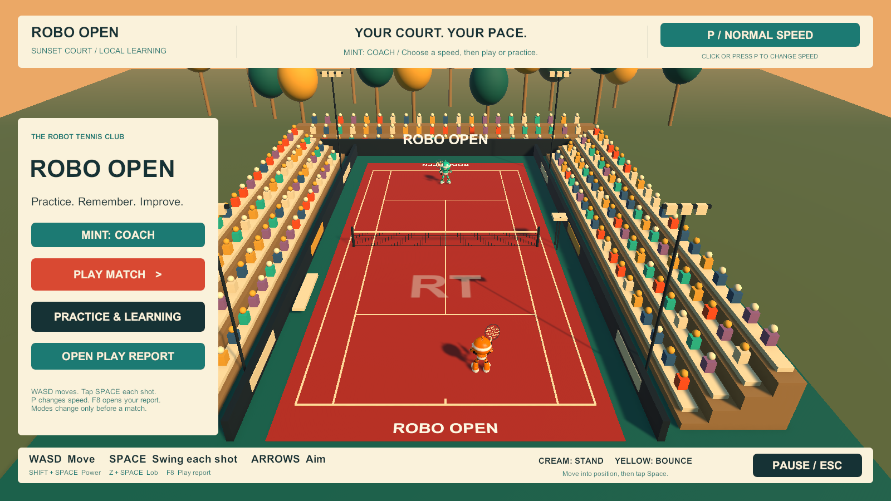
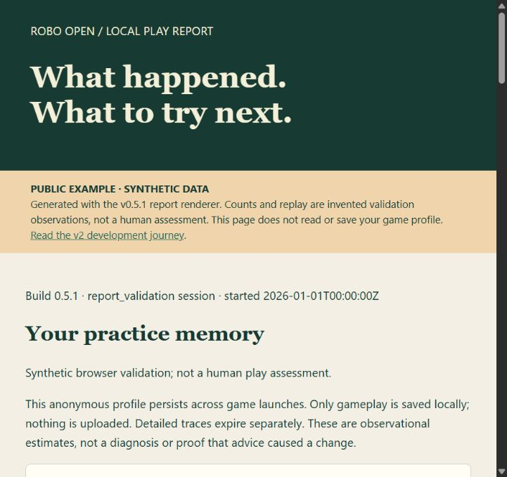

# Robo Open

A playable Windows tennis prototype built with Unity, Blender, Meshy and a largely autonomous Codex / GPT-6 Astra workflow.

Inspired by [Chong-U’s original YouTube game-building video](https://www.youtube.com/watch?v=DQfL_l5lRpk). The creator’s project was unavailable, so this is a new reconstruction using newly generated and authored assets. It reproduces the broad visual direction; it does not contain the creator’s original assets.

**[Read the development journeys — Original + v1 + v2](https://az9713.github.io/gpt-6-astra-tennis-game/JOURNEYS.html#v2)** · [v2: Practice memory and learning](https://az9713.github.io/gpt-6-astra-tennis-game/DEVELOPMENT-JOURNEY-V2.html) · [v1: Gameplay enhancements](DEVELOPMENT-JOURNEY-V1.html) · [Original journey](DEVELOPMENT-JOURNEY.html) · [Download the Windows prototype](https://github.com/az9713/gpt-6-astra-tennis-game/releases/latest)

The new **v2 journey** follows persistent memory, twelve-ball drills, Coach and Competitive Mint, evaluation and rollback, and both attempts to repair HTML report opening. It explains human decisions, tool roles, failures, evidence and remaining limits. Explore an illustrative shot-policy control and the interactive example report. Original and v1 journey files are preserved unchanged. Chapter names are separate from software release numbers.

## Practice & Learning: the new main menu



Fresh capture of the local **v0.5.1** Windows build. Choose **Practice & Learning** for Timing, Position or Fixed Benchmark drills and Mint adaptation controls. Coach is the initial default. This documentation showcase does not replace the previously published Windows release.

## Explore the new Play Report

**[Open the interactive Play Report →](https://az9713.github.io/gpt-6-astra-tennis-game/docs/examples/play-report-v2.html)**

[](https://az9713.github.io/gpt-6-astra-tennis-game/docs/examples/play-report-v2.html)

The report shows practice context, uncertainty, diagnostics for both players and a sampled court replay. Open it and scroll to **Missed-return replays → Play / pause**. All example observations are **synthetic**; no private play history is published, and no real improvement or promoted Mint policy is claimed. GitHub displays this linked preview; the interactive HTML runs on Pages. [Download the standalone HTML](docs/examples/play-report-v2.html).

The **v1 journey** remains available with the four strokes, rig repairs, fairer returns, human playtest findings, slow-motion practice and the two-bar UI.

## Latest match recording: quarter-speed practice

https://github.com/user-attachments/assets/1d02b5fa-4f1f-4f1f-ac62-1134674e9451

Actual play in the local v0.4.1 build, showing quarter-speed practice and the simplified two-bar UI. Silent **94.2-second** preview at **720p / 30 fps**, compressed from **76.02 MB to 5.09 MB** (**93.3% smaller**). [Download the MP4](docs/media/match2.mp4). The original recording is preserved locally; the earlier match video remains below.

## Local v0.5.1: full HTML report repair

**Open Full HTML** now displays the report through a temporary local web address instead of a file URL. Keep the game running while viewing it. Reports remain on your computer; the viewer serves only the selected report. The launcher prefers this build. [Usage and privacy](LEARNING.md).

## Local v0.5: practice memory and learning

Coach and Competitive modes, local persistent profiles, comparable progress reports, twelve-ball drills, and conservatively evaluated Mint shot-choice adaptation. Coach is the initial default. **F8 or Ctrl+F8 now shows a report inside the game**, in the left margin, with optional full HTML export. No browser is required for immediate feedback. [How to use it and its limits](LEARNING.md) · [Agreed delivery plan](NEXT-VERSION.md).

The local launcher now prefers v0.5.1. Published release links still refer to the existing GitHub release until a new archive is published. New learning starts with v0.5; older logs are not silently treated as comparable training data.

Validation: **156 checks passed** (30 rules, 58 learning/storage checks, 68 standalone input/UI checks), plus a one-minute rally run with an 18-shot best rally. These validate functionality, not measured human improvement. [Verification receipt](docs/evidence/learning/verification.json).

## Local v0.4.1: unobstructed court view

Seven separate HUD cards have been consolidated into two slim edge bars: scores, rally count, shot guidance and practice speed at the top, controls and marker guidance at the bottom. Pause, welcome and match results use a compact left-side panel only when needed; point announcements stay in the top bar. The center of the court stays visible. This layout is retained in later local builds.

## Local v0.4: slow-motion practice

Press **P** or click the **speed button** to cycle **normal → half → quarter → normal**. Choose a speed before starting or change it during a rally or pause. The ball, both robots, stroke animations and swing buffer slow together. Pause/resume and match restart retain your choice; a fresh launch starts at normal speed.

Move with WASD toward the cream standing ring and **tap Space for each return**. Yellow marks the bounce, not an automatic block. At half speed you have twice the real time to react; at quarter speed, four times. F8 reports flag sessions that used practice speed, record the speed of each exchange, and distinguish game-time from real-time hitting windows.

This update is available in the local `Builds/RoboOpen-Windows-v0.4` build through `PLAY_ROBO_OPEN.cmd`. The GitHub release link below remains the previously published version until a new release is published.

## New in v0.3: fairer returns and local play reports

Early swings now remain buffered for 0.48 seconds, contact prediction follows legal bounces, and the readiness cue uses the same planner as actual returns. A cream ring suggests where to stand. **Tap Space for each shot; release between shots.**

Press **F8** or choose **PLAY REPORT** in the pause/result menu for recommendations about both You and Mint, backed by recorded swing decisions and short court replays. Active play pauses before the report opens. Recordings stay local, with bounded retention and no automatic uploads. [How diagnosis works](PLAY-DIAGNOSTICS.md) · [Example report from synthetic tests](https://az9713.github.io/gpt-6-astra-tennis-game/docs/examples/play-report.html) · [Verification](docs/evidence/diagnostics/).

## Added in v0.2: structural tennis motion

**[Watch the four new strokes](https://az9713.github.io/gpt-6-astra-tennis-game/MOTION-UPGRADE.html)** — forehand, backhand, automatic smash and serve/trophy preparation. The robot keeps its 16-bone rig, with six coordinated clips, repaired skin weights and synchronized racket contact. No additional Meshy credits were spent.

Open `VIEW_ROBOT_MOTION.cmd` in the Windows release to inspect the animations close up. **B** toggles bone guides; **Escape** closes that viewer. In the game, simply swing with Space at a suitable high ball to smash—no extra key. [Implementation and validation](MOTION-UPGRADE.md).

https://github.com/user-attachments/assets/6ed778ab-f3c6-43f9-9660-f7c9f040a1d6

Actual Unity motion-viewer capture: four strokes in 12 seconds, with joint guides visible. [MP4 download](docs/media/motion.mp4).

## Original v0.1 match recording

https://github.com/user-attachments/assets/177254a0-b72f-480b-b75d-bea627ec2576

The supplied recording is a silent 56.5-second preview, compressed from 45.2 MB to **2.81 MB** (94% smaller). [Repository MP4](docs/media/match.mp4). The HTML journey also includes a video player.

## Play on Windows

1. Download the Windows ZIP from the [latest release](https://github.com/az9713/gpt-6-astra-tennis-game/releases/latest).
2. Extract the entire archive. Keep the executable, data folder and runtime files together.
3. Open `PLAY_ROBO_OPEN.cmd`, click **PLAY MATCH**, and press **Space** to serve.

The build is an unsigned prototype. Unity and Blender are not required to play the downloaded release.

| Control | Action |
|---|---|
| WASD | Move |
| Space / Enter / left mouse | Serve or swing |
| Arrow keys | Aim return direction and depth |
| Shift + Space | Power return |
| Z + Space | Lob |
| Escape | Pause / resume |
| R | Restart |
| F8 / Ctrl+F8 | Pause and show the in-game report; optional full HTML export |
| P | Normal / half / quarter speed |
| Alt + F4 | Exit |

Use the cream standing-position ring and yellow bounce marker; tap when **SWING NOW** appears, or slightly early. Return a serve after its first bounce. The inner sidelines define the singles court. Scoring includes deuce and advantage; **first to two games wins** this short exhibition. `OPEN_PLAY_REPORT.cmd` opens your latest saved report after playing.

## What is included

- Two toy robots, six animation clips, coral court, stepped crowds, trees, lighting and a mint CPU opponent.
- Serving, volleys, normal/power/lob returns, net/out/double-bounce rules, scoring, menu, pause, result and replay.
- Unity source, editable Blender sources, saved Meshy outputs, asset-generation scripts and public verification receipts.
- An evidence-based development journey: original prompts, human decisions, tool use, failed assumptions, fixes, costs and remaining gaps.
- Local session recording, cause-based advice for both players, and sampled missed-return replays.

Racket contact uses a forgiving reach zone. Animation and CPU strategy are prototype quality. Multiplayer, progression, tournaments and a browser build of the tennis game are not included. The earlier WebGL diagnostic fixture is a separate preflight test.

## Edit and rebuild

Use **Unity 6000.5.7f1** with Windows build support. The project pins its packages, including URP 17.5.0, in `TennisGame/Packages/`.

1. Open `TennisGame` in Unity and allow package resolution/import to finish.
2. Open `Assets/Prototype/RoboOpen.unity` and enter Play mode.
3. To build from a terminal with that project closed in the Editor, run:

```powershell
& '<path-to-Unity.exe>' -batchmode -quit -projectPath "$PWD/TennisGame" -executeMethod PrototypeSetup.BuildReportFixWindows -logFile build.log
```

The current local output is `Builds/RoboOpen-Windows-v0.5.1/RoboOpen.exe`. `PLAY_ROBO_OPEN.cmd` prefers that location. The **Robo Open → Build prototype scene** Editor menu regenerates the scene and runs import/rules checks; it overwrites manual edits to that generated scene.

Blender **5.2.1 LTS** was used for `SourceAssets/Robot/RoboPlayer.blend` and `setup/rig_robot_blender.py`. Blender and Meshy are unnecessary for rebuilding the saved Unity assets. Regenerating a Meshy model is optional, requires your own `MESHY_API_KEY` in a private `.env`, and can spend credits. This run consumed **30 Meshy credits**; other service costs were not measured.

After building, run the standalone input and rally checks:

```powershell
powershell -ExecutionPolicy Bypass -File setup/verify_prototype.ps1 -BuildDirectory Builds/RoboOpen-Windows-v0.5.1
```

The original run passed 17 rules checks and 17 input/UI checks; v0.2 passes 17 rules checks and 26 input/UI checks. The v0.1 run recorded 15 player returns, 18 CPU returns, a best rally of 18 and two points; the v0.2 motion pass adds a separate [current validation record](docs/evidence/motion/). These are functional checks; human enjoyment, fairness and broad hardware compatibility remain unvalidated. [Results and limits](PROTOTYPE_RESULTS.md) · [Public receipts](docs/evidence/).

The v0.3 pass adds **30 rules/diagnostic checks and 39 standalone input/UI checks**, including moving-ball timing and durable recording. [Current results](docs/evidence/diagnostics/).

## Explore the build

| Start here | What it explains |
|---|---|
| [Development journey](DEVELOPMENT-JOURNEY.md) | The complete chronology, human involvement and unknown unknowns |
| [Prototype design](PROTOTYPE_DESIGN.md) | Visual and gameplay choices |
| [Asset prompt](SourceAssets/Robot/IMAGE_PROMPT.md) | The new robot’s reference design |
| [Blender rig script](setup/rig_robot_blender.py) | Skeleton, skin weights and authored animation |
| [Unity scene generator](TennisGame/Assets/Prototype/Editor/PrototypeSetup.cs) | Court, stadium and presentation |
| [Game controller](TennisGame/Assets/Prototype/Scripts/TennisGame.cs) | Ball trajectories, opponent and match state |
| [Preflight results](PREFLIGHT_RESULTS.md) | Scale, animation, rendering and export failures |

To regenerate the standalone HTML after editing its Markdown source, install `setup/requirements-docs.txt`, then run `python setup/build_journey.py`. The published HTML needs no external libraries.

## Publication boundary

Credentials, original video/transcript copies, raw session history, private service identifiers, machine paths, build caches and local logs are excluded. Public documents and model metadata were checked before publication. The requested GitHub repository identity and the original creator attribution are retained.

No blanket license is asserted for third-party software or generated assets. Review the relevant provider terms before redistribution beyond this repository; Unity packages retain their own licenses.
